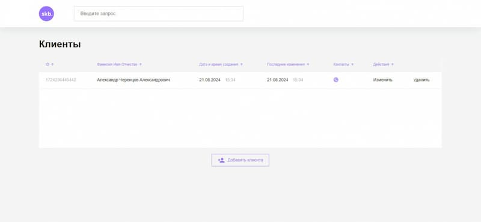

```markdown
# CRM Application

This CRM application allows you to manage clients and their contact information. It offers features for adding, editing, and deleting clients, as well as searching through the client list.

## Table of Contents
- [Features](#features)
- [Installation and Setup](#installation-and-setup)
- [Usage](#usage)
- [Screenshots](#screenshots)
- [Note](#Note)

## Features

- **Add Clients:** Add new clients along with their contact details.
- **Edit Clients:** Update client information as needed.
- **Delete Clients:** Remove clients from the system.
- **Search Clients:** Search through the client list to find specific entries.

## Installation and Setup

To install and run the project locally, follow these steps:

1. To install and run the project locally, follow these steps:
   ```bash
   git clone https://github.com/AlexanderCherentcov/CRM.git

2. Navigate to the project directory:
   ```bash
   cd CRM

3. Navigate to the todo-server directory and start the server:
   ```bash
   cd crm-backend
   node index
 
4. В новом терминале перейдите в директорию проекта:
   ```bash
   cd CRM

5. In a new terminal, go to the project directory:
   ```bash
   cd crm-frontend
   npm install
   npm run dev

Once you complete these steps, the application will be available for use.

## Usage

The application provides an interface for managing clients. You can add new clients, edit their details, delete them, and search through the client list to find specific clients.

## Screenshots

Main screen of the CRM application


## Note

I didn't write crm-backend myself, I just used it for my project. The backend was developed by Skillbox.
